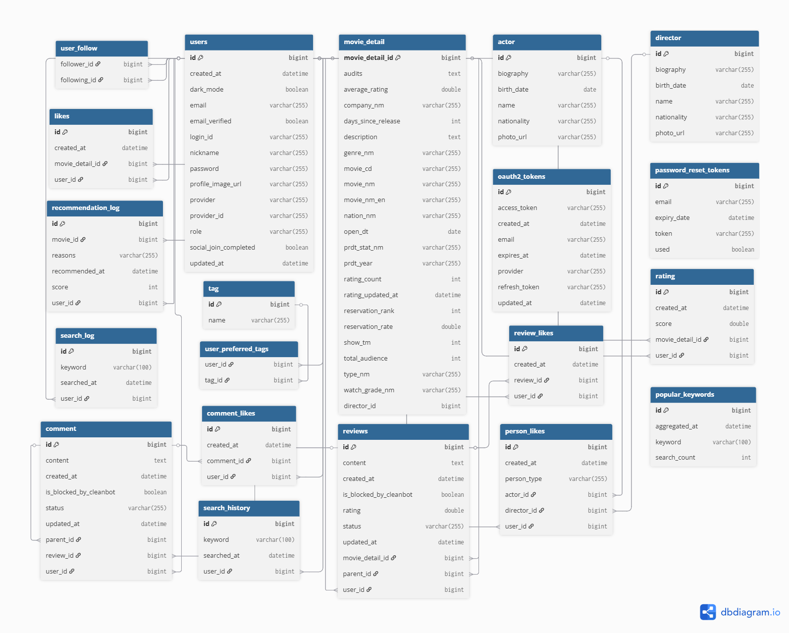

# 🎬 movie-project

사용자 취향을 분석해 **개인 맞춤형 영화**를 추천하고,  
리뷰·댓글·별점 등 소셜 기능과 영화 정보 챗봇을 제공하는 풀스택 영화 서비스입니다.  
백엔드는 **Spring Boot**, 프론트엔드는 **React**로 구현하며,  
MCP Server(Node.js)와 외부 영화 API(KOBIS, TMDB, KMDB, NAVER) 연동,  
Redis 기반 세션/캐시, Docker 컨테이너 환경을 지원합니다.

## Live
- 서비스: https://filmer-movie.duckdns.org

## 📊 WBS (Work Breakdown Structure)


## 📋 전체 흐름 구상도


## 🗄️ 데이터베이스 흐름도




---

## 📚 프로젝트 개요

- **프로젝트 기간:** 2025년 6월 ~ 7월 (3주간)
- **기획 목표:** 도메인 기반 CRUD 설계, 추천 알고리즘, 실무형 협업 및 인프라 경험
- **주요 기능:** 
  - 사용자 맞춤 영화 추천 시스템
  - 소셜 기능(댓글, 별점, 좋아요, 대댓글)
  - OAuth2 소셜 로그인(카카오/네이버)
  - 영화 정보/검색 챗봇 (MCP Server, Node.js)
  - 외부 영화 API(KOBIS, TMDB, KMDB, NAVER) 연동
  - 박스오피스/영화 데이터 자동 동기화(배치)
  - 클린봇(댓글 욕설 필터링)
  - Redis 기반 세션/캐시
  - Docker 기반 개발/운영 환경

---

## ⚙️ 기술 스택

| 분야      | 기술                                                                                  |
|-----------|--------------------------------------------------------------------------------------|
| Backend   | Java 21, Spring Boot, Spring Data JPA, Spring Security, QueryDSL, MapStruct, Jackson, Java Mail |
| DB        | MySQL, Redis (세션/캐시)                                                             |
| Frontend  | React 18, Axios, Chart.js, Styled-components, React Testing Library, Jest            |
| Auth      | Spring Security + OAuth2 (카카오/네이버)                                             |
| DevOps    | Maven, GitHub, GitHub Actions(예정), Docker                                          |
| 기타      | Lombok, Batch, Scheduler, JUnit, Mockito, MCP Server(Node.js, 영화 검색/정보 연동용) |
| 외부 API  | KOBIS, TMDB, KMDB, NAVER 영화                                                        |

---

## 👥 팀원 역할 분담

### 🟦 규현: CRUD 중심 / 데이터 생성자
**목표: 도메인 설계 & 데이터를 만드는 모든 기능**

**영화/배우/감독/시네마/예매/결제 도메인**
- 영화 등록/수정/삭제, 상세 조회, 좋아요, 태그/배우/감독/장르별 관계 설정
- 박스오피스/명작/평균 별점 높은 영화 리스트, 개봉/예정 영화, 상영관/좌석 관리
- 자동 영화 데이터 동기화(일일 박스오피스, 신작/상세정보/포스터/스틸컷 자동 수집, 스케줄러 모니터링)
- 예매(영화관/좌석/날짜 선택, 예매 목록), 결제(토스/카카오/네이버, 성공/실패, 영수증 출력)
- 더미 데이터 생성(data.sql 또는 API)

**리뷰/댓글/코멘트**
- 영화리뷰/댓글 작성, 수정, 삭제, 좋아요(토글), 대댓글, 리스트 출력

**추천 시스템**
- 태그/평균 별점/배우/감독/친구/새로운 장르 기반 영화 추천

**챗봇**
- 영화 검색/상세/추천 챗봇 (UI, MCP Server, AI(Cursor) 연동)

**통합 테스트/예외 처리**
- 전체 기능 통합 테스트, 프론트엔드 연동 테스트, 예외처리 및 버그 수정

---

### 🟨 승현: 검색/추천/인증 중심 / 데이터 소비자
**목표: 데이터를 가공하고 검색, 추천, 통계를 담당**

**회원/인증/소셜**
- 자체 회원가입, 소셜 연동(OAuth2), 로그인/회원가입/비밀번호 찾기/재설정

**검색/정렬/인기 검색어**
- 영화/배우/감독/유저 통합 검색, 정렬 기준, 최근/실시간 인기 검색어 저장

**별점/통계**
- 별점 기록 저장/수정, 평균 별점 계산 및 캐싱, 점수별 별점 시각화

**마이페이지/팔로우/태그**
- 내가 작성한 코멘트/좋아요/찜한 영화, 유저 팔로우, 태그 설정

**추천 시스템(프론트/통계)**
- 태그/평균 별점/배우/감독/친구/새로운 장르 추천 UI 및 통계 시각화

**클린봇**
- 욕설 필터링 사전 구축, 필터링 로직 적용, 필터링 댓글 저장, 테스트 케이스 작성
- 욕설 필터링 UI, 테스트

**통합 테스트/예외 처리**
- 전체 기능 통합 테스트, 예외처리 및 버그 수정

---

### 🟩 영훈: UI/UX 설계 및 프론트엔드 화면 구현
**목표: 전체 서비스의 화면 설계 및 UI/UX 구현**

**Figma 화면 설계 및 프론트엔드 UI**
- MainPage, LoginPage, SignupPage, FindId/FindPW/PasswordResetPage, SearchOverlay, MovieListPage, CommentOverlay, CommentListOverlay, DetailCommentOverlay, MovieDetailPage, DirectorPage, ActorPage, MyPage, AdminPage, PaymentPage, NotFoundPage 등  
- 각종 오버레이/모달/상세 페이지 UI 설계 및 구현


---

## 🚀 실행 방법

### ✅ MySQL DB 설정

```sql
CREATE DATABASE movie_db CHARACTER SET utf8mb4 COLLATE utf8mb4_unicode_ci;


위 명령어로 MySQL에 movie_db 데이터베이스를 생성합니다.

로컬에서 application.properties 파일을 생성하고 다음과 같은 형식으로 작성하세요


spring.datasource.url=jdbc:mysql://localhost:3306/movie
spring.datasource.username=your_username
spring.datasource.password=your_password
spring.datasource.driver-class-name=com.mysql.cj.jdbc.Driver

